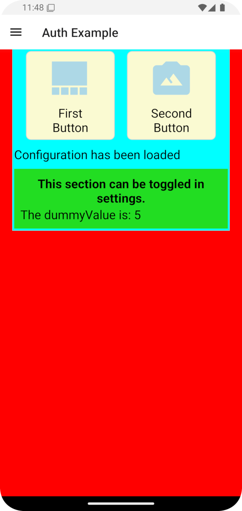
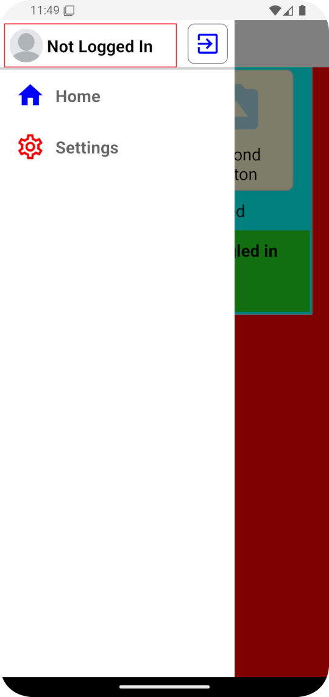
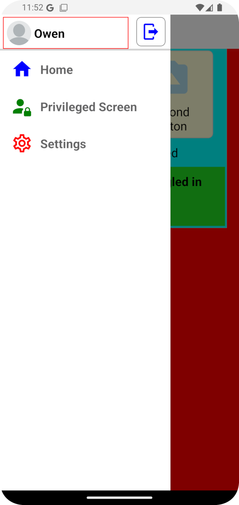
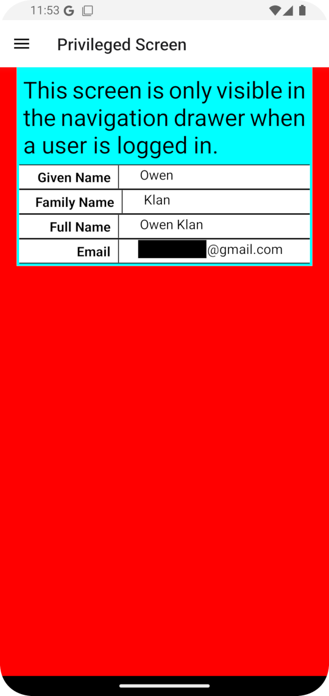
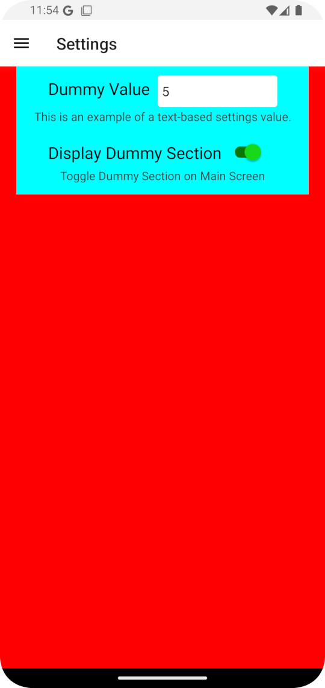

# react-native-drawer-nav-google-auth

This simple React Native template comes with a few things rolled in:
- TypeScript support.
- Icons provided by `react-native-vector-icons/MaterialCommunityIcons`. Icon
  names can be found at [on this site](https://static.enapter.com/rn/icons/material-community.html).

- Google SSO Authentication

  - Gradle build configured to load app credential details from file which is
    not tracked in source control

- Drawer Navigation with:
  
  - Custom drawer content
  - Drawer items that are only rendered if a user has successfully authenticated

- Simple configuration load and store with example settings screen

  - Loads defaults on first app run
  - **NOTE:** This uses NON-SECURE AsyncStorage, but can be easily enhanced with secure
    options

- ESLint is configured to use 4 spaces for indentation.

- Helper shell scripts for bundling, building and starting metro

- Example "privileged access" screen, demonstrating access to authenticated User details.

## Usage
To start a new project using this template, we use `react-native init` with the `--template`
option.

**IMPORTANT!** For Google SSO/OAuth2 to work, you're also going to need to use the
`--package-name` option and this must match the package name you configure in the
Google OAuth2 credentials configuration.

```shell
`react-native init \
    --package-name com.projectname \
    --title 'App Title' \
    --pm npm \
    --template 'https://github.com/owenjklan/react-native-drawer-nav-google-auth.git'
    <YourProjectName>`
```

Android projects do not appear to be correctly setting the application name string.
This is the name of the application that will be seen with the app icon when
it is installed on a user's device. This can be easily changed by updating the
value of `<string name="app_name">` inside `android/app/src/main/res/values/strings.xml`


---

### **NOTE:** This template has not been developed or tested on iOS.

---

## Configuring Gradle with Signing configuration
`android/app/build.gradle` is configured to load details of your app's keystore
and signing keys from `android/app/secret.properties`. This second file should not
be tracked in source control. The `.gitignore` provided with this template should
take care of that, but be sure to double-check!

An example `secret.properties` file content is below:
```text
// Secrets for use with Google OAuth/SSO
// This should NOT be added to source control!
MYAPP_UPLOAD_STORE_FILE=<Path to .jks keystore file>
MYAPP_UPLOAD_KEY_ALIAS=<alias of signing key>
MYAPP_UPLOAD_STORE_PASSWORD=<password for keystore>
MYAPP_UPLOAD_KEY_PASSWORD=<password for the signing key alias>
```

## Screenshots
Some example screenshots of the basic template are provided below.

Note the use of hard colours like red and cyan is deliberate for the template,
to show the bounds of certain views. It is not expected to be used like this
in a released app, because it honestly looks terrible, but the colour choices
can easily be changed as desired.

### Main screen example


### Navigation drawer when user isn't authenticated


### Navigation drawer when user has authenticated


### Example "privileged" screen, accessing user information


### Example configuration / settings

